<div align="center">
  

  <br/><br/>

  
  
  
  
</div>

> One tap keeps it airborne. Everything else is timing.

## Overview

A ground-up recreation of the *Flappy Bird* arcade loop, written in **C++20** on top of **SFML 2.6**. The whole game runs on a small, stack-based finite state machine — `Splash → Main Menu → Gameplay → Game Over` — so each screen owns its own input, update, and draw logic instead of one tangled loop trying to do everything.

## Features

| | |
|---|---|
| **State machine core** | A reusable `StateMachine` stack drives four states: `SplashState`, `MainMenuState`, `GameState`, `GameOverState`. |
| **Bird physics** | Gravity, a flap impulse, and velocity-driven rotation, animated across four sprite frames. |
| **Procedural pipes** | Spawned on a timer with randomized gap height. |
| **Scrolling world** | A seamlessly tiling ground layer keeps the run feeling continuous. |
| **Collision system** | Sprite-based checks between bird, pipes, and ground. |
| **Medals** | Bronze, Silver, Gold, and Platinum, awarded by score threshold. |
| **Persistent best score** | Written to disk and reloaded on the next run. |
| **Sound** | Distinct cues for flapping, scoring, and colliding. |
| **Asset management** | Textures, fonts, and sounds are cached once and reused through `AssetManager`. |

## Controls

| Action | Input |
|---|---|
| Flap / Start / Retry | Left mouse click |

## Tech Stack

| | |
|---|---|
| Language | C++20 |
| Library | [SFML](https://www.sfml-dev.org/) 2.6.2, vendored under `External Libraries/SFML` |
| Build | Visual Studio solution (`.slnx`) + `.vcxproj` |
| Toolset | MSVC `v145` (Visual Studio 2026) |
| Targets | Windows, x86 / x64 |

## Project Structure

```
FlappyBird/
├── External Libraries/
│   └── SFML/                      # Bundled SFML 2.6.2 (include, lib, bin)
├── SFML Template/
│   ├── FlappyBird.slnx             # Visual Studio solution
│   └── SFML Template/
│       ├── main.cpp                # Entry point
│       ├── DEFINITIONS.hpp         # Screen size, speeds, medal thresholds…
│       ├── Game.cpp / .hpp         # Core loop & shared GameData
│       ├── StateMachine.cpp / .hpp # Stack-based state manager
│       ├── State.hpp               # Abstract state interface
│       ├── SplashState.*           # Splash screen
│       ├── MainMenuState.*         # Main menu
│       ├── GameState.*             # Core gameplay loop
│       ├── GameOverState.*         # Game over + medals screen
│       ├── Bird.cpp / .hpp         # Physics & animation
│       ├── Pipe.cpp / .hpp         # Spawning & movement
│       ├── Land.cpp / .hpp         # Scrolling ground
│       ├── Collision.cpp / .hpp    # Sprite collision checks
│       ├── HUD.cpp / .hpp          # Score display
│       ├── Flash.cpp / .hpp        # Screen flash on collision
│       ├── AssetManager.cpp / .hpp # Texture/font/sound cache
│       ├── InputManager.cpp / .hpp # Mouse input handling
│       └── Resources/
│           ├── audio/               # Hit.wav, Point.wav, Wing.wav
│           ├── fonts/                # FlappyFont (04b19), Arial, Marker Felt
│           └── res/                  # Sprites: bird frames, pipes, medals, backgrounds
└── .gitignore
```

## Build & Run

**Prerequisites**

- Windows 10/11
- Visual Studio 2026 (or newer) with the *Desktop development with C++* workload
- SFML is already vendored under `External Libraries/SFML` — nothing extra to install

**Steps**

1. Clone the repository
   ```bash
   git clone https://github.com/prasubhpokharel/FlappyBird.git
   cd FlappyBird
   ```
2. Open `SFML Template/FlappyBird.slnx` in Visual Studio.
3. Pick a platform — `x64` or `x86` — from the configuration dropdown.
4. Build and run with `Ctrl + F5`.

> SFML's runtime DLLs already sit next to the project, so a local build works without copying anything by hand.

## Roadmap

- Add a `LICENSE`
- CMake support for Linux/macOS builds
- Difficulty scaling as the score climbs
- Keyboard input as an alternative to mouse clicks
- An online leaderboard

## Contributing

1. Fork the project
2. Create a feature branch — `git checkout -b feature/amazing-feature`
3. Commit your changes — `git commit -m 'Add some amazing feature'`
4. Push the branch — `git push origin feature/amazing-feature`
5. Open a Pull Request

## License

No license has been specified yet. Consider adding one — [MIT](https://choosealicense.com/licenses/mit/) is a common, permissive default — so others know how they're allowed to use the code.

## Author

**Prasubh Pokharel** — [github.com/prasubhpokharel](https://github.com/prasubhpokharel)

<br/>

<div align="center">
  
</div>